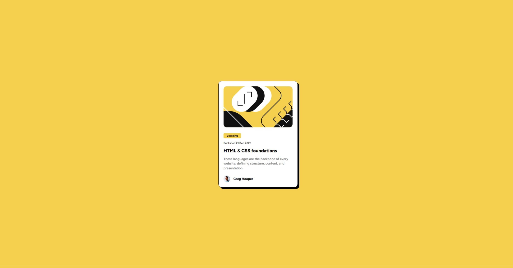

# Frontend Mentor - Blog preview card solution

This is a solution to the [Blog preview card challenge on Frontend Mentor](https://www.frontendmentor.io/challenges/blog-preview-card-ckPaj01IcS). Frontend Mentor challenges help you improve your coding skills by building realistic projects. 

## Table of contents

- [Overview](#overview)
  - [The challenge](#the-challenge)
  - [Screenshot](#screenshot)
  - [Links](#links)
- [My process](#my-process)
  - [Built with](#built-with)
  - [What I learned](#what-i-learned)

**Note: Delete this note and update the table of contents based on what sections you keep.**

## Overview

### The challenge

Users should be able to:

- See hover and focus states for all interactive elements on the page

### Screenshot



### Links

- Solution URL: (https://github.com/xirb22/blog-preview-card-main)
- Live Site URL: (https://xirb22.github.io/blog-preview-card-main/)

## My process

### Built with

- Basic HTML and CSS
- CSS custom properties
- Flexbox


### What I learned

- How to import local font assets using CSS
```css
   @font-face {
      font-family: 'Figtree';
      src: url("assets/fonts/Figtree-VariableFont_wght.ttf") format("truetype");
    }
```

- How to perform media queries based on screen width
```css
    @media screen and (max-width: 400px) {
      html {
        font-size: 14px;
      }
```

- How to perform horizontal and vertical centering using flexbox
```css
 body {

      display: flex;
      min-height: 100vh;
      flex-direction: column;
      align-items: center;
      justify-content: center;

    }
```

- Using custom variables in CSS
```css
    :root {
      --clr-yellow: hsl(47, 88%, 63%);
      --clr-white: hsl(0, 0%, 100%);
      --clr-grey: hsl(0, 0%, 50%);
      --clr-black: hsl(0, 0%, 7%);
    }
```

- Using 'object-fit: cover' to clip an image based on element width
```css
    .illustration {
      max-width: 80vw;
      height: 201px;
      margin: 1.5rem 1.5em;
      border-radius: 1rem;
      object-fit: cover;
      clip-path: content-box;
    }
```
- Using CSS pseudoselectors for dynamic pages
```css
    .title:hover {
      color: var(--clr-yellow);
      cursor: pointer;
    }
```

- Using flexbox for horizontal arrangements of different elements
```css
    .profile {
      margin: 1.5rem;

      display: flex;
      flex-direction: row;
      align-items: center;
      gap: 1rem;
      justify-content: flex-start;

      font-weight: 800;
    }
```
